# 🤖 AI Document Assistant

<div align="center">


**🚀 Advanced AI-powered document analysis with OCR and intelligent Q&A**

*Upload documents, extract text with high-accuracy OCR, and chat with AI using Google Gemini*

[🌟 Features](#-features) • [🚀 Quick Start](#-quick-start) • [📖 Usage](#-usage) • [🛠️ Installation](#️-installation) • [🎯 Demo](#-demo)

</div>

---

## ✨ Features

### 📄 **Multi-Format Support**
- **PDF Documents** - Text extraction + Advanced OCR for scanned PDFs
- **Word Documents** - DOCX/DOC file processing
- **Images** - JPG, PNG, GIF, BMP, TIFF with high-accuracy OCR
- **Handwritten Notes** - Enhanced preprocessing for scanned handwriting

### 🧠 **AI-Powered Intelligence**
- **Google Gemini Integration** - State-of-the-art language model
- **Intelligent Q&A** - Ask questions about your documents
- **Context-Aware Responses** - AI understands document context
- **Smart Templates** - Pre-built questions for different document types

### 🎨 **Modern Interface**
- **Dark Theme UI** - Beautiful animated interface
- **Real-time Chat** - ChatGPT-style conversation interface
- **Drag & Drop Upload** - Intuitive file handling
- **Progress Tracking** - Visual feedback during processing
- **Responsive Design** - Works on desktop and mobile

### ⚡ **Advanced OCR Technology**
- **EasyOCR Engine** - High-accuracy text recognition
- **Image Preprocessing** - Noise reduction and enhancement
- **Batch Processing** - Memory-efficient handling of large files
- **Multi-language Support** - Extensible language detection

### 🔒 **Privacy & Security**
- **Session-based Storage** - No permanent data storage
- **Local Processing** - Files processed locally
- **Automatic Cleanup** - Temporary files removed after processing
- **Secure File Handling** - Input validation and sanitization

---

## 🚀 Quick Start

### Prerequisites
- Python 3.8+
- Google Gemini API Key ([Get one here](https://makersuite.google.com/app/apikey))
- System dependencies for OCR

### 1-Minute Setup

```bash
# Clone the repository
git clone https://github.com/yourusername/ai-document-assistant.git
cd ai-document-assistant

# Create virtual environment
python -m venv venv
source venv/bin/activate  # On Windows: venv\Scripts\activate

# Install dependencies
pip install -r requirements.txt

# Install system dependencies (Ubuntu/Debian)
sudo apt update
sudo apt install poppler-utils libgl1-mesa-glx libglib2.0-0

# Run the application
python app.py
```

🎉 **Open http://localhost:5000 and start chatting with your documents!**

---

## 📖 Usage

### 1. **Upload Your Document**
- Drag & drop or click to select files
- Supported: PDF, DOCX, JPG, PNG, and more
- Enter your Google Gemini API key

### 2. **AI Processing**
- Advanced OCR extracts text from images/scanned documents
- AI analyzes content and prepares for Q&A
- Progress bar shows real-time processing status

### 3. **Chat with Your Document**
- Ask questions in natural language
- Get intelligent, context-aware answers
- Use smart templates for common document types
- View chat history and clear when needed

### 📋 **Smart Templates**

| Document Type | Example Questions |
|---------------|-------------------|
| **📄 Resume** | "What are the candidate's key skills?" |
| **📊 Invoice** | "What is the total amount and due date?" |
| **📋 Contract** | "Who are the parties and what are the terms?" |
| **📈 Report** | "What are the main findings and recommendations?" |

---

## 🛠️ Installation

### System Requirements

```bash
# Ubuntu/Debian
sudo apt update
sudo apt install poppler-utils libgl1-mesa-glx libglib2.0-0

# macOS
brew install poppler

# Windows
# Download poppler from: https://github.com/oschwartz10612/poppler-windows
```

### Python Dependencies

```bash
pip install -r requirements.txt
```

<details>
<summary>📦 View all dependencies</summary>

```
Flask==2.3.3
easyocr==1.7.0
google-generativeai==0.3.2
PyMuPDF==1.21.1
Pillow==9.5.0
numpy==1.24.3
opencv-python==4.8.1.78
python-docx==1.1.0
pdf2image==1.16.3
gunicorn==21.2.0
```

</details>

### Configuration

1. **Get Google Gemini API Key**
   - Visit [Google AI Studio](https://makersuite.google.com/app/apikey)
   - Create a new API key
   - Keep it secure and don't share publicly

2. **Environment Setup** (Optional)
   ```bash
   export GEMINI_API_KEY="your-api-key-here"
   ```

---

## 🎯 Demo

### 📱 **Interface Preview**

```
🤖 AI Document Assistant
┌─────────────────────────────────────┐
│  📤 Upload Document                 │
│  ┌─────────────────────────────────┐ │
│  │ 🔑 API Key: ••••••••••••••••••• │ │
│  │ 📄 Drop your document here      │ │
│  │    Supports: PDF, DOCX, Images  │ │
│  └─────────────────────────────────┘ │
│  [🔧 Process Document]              │
└─────────────────────────────────────┘

🤖 Chat Interface
┌─────────────────────────────────────┐
│ 🤖 Hello! I've processed your PDF  │
│    "research_paper.pdf". What      │
│    would you like to know?         │
│                                     │
│ 👤 What is the main research       │
│    question?                   You │
│                                     │
│ 🤖 Based on the document, the main │
│    research question is...         │
└─────────────────────────────────────┘
```

### 🔥 **Performance Stats**

- **OCR Accuracy**: 95%+ on clear documents
- **Processing Speed**: ~30 seconds for 10-page PDF
- **File Size Limit**: Up to 20MB
- **Supported Languages**: English (extensible)
- **Memory Usage**: Optimized batch processing

---

## 🏗️ Architecture

```mermaid
graph TD
    A[📄 Document Upload] --> B[🔍 File Type Detection]
    B --> C{File Type?}
    C -->|PDF| D[📖 PyMuPDF Text Extraction]
    C -->|DOCX| E[📝 Python-docx Processing]
    C -->|Image| F[🖼️ Direct OCR Processing]
    D --> G{Text Found?}
    G -->|Yes| H[✅ Use Extracted Text]
    G -->|No| I[🔍 OCR Fallback]
    I --> J[📊 Image Preprocessing]
    J --> K[🤖 EasyOCR Processing]
    E --> L[🧠 Gemini AI Setup]
    F --> J
    H --> L
    K --> L
    L --> M[💬 Interactive Q&A]
```



---

## 🚀 Deployment

### Local Development
```bash
python app.py
# Access at http://localhost:5000
```

### Production Deployment

<details>
<summary>🐳 Docker Deployment</summary>

```dockerfile
FROM python:3.9-slim

WORKDIR /app
COPY requirements.txt .
RUN pip install -r requirements.txt

# Install system dependencies
RUN apt-get update && apt-get install -y \
    poppler-utils \
    libgl1-mesa-glx \
    libglib2.0-0 \
    && rm -rf /var/lib/apt/lists/*

COPY . .
EXPOSE 5000

CMD ["gunicorn", "-c", "gunicorn.conf.py", "app:app"]
```

</details>

<details>
<summary>☁️ Cloud Deployment (Render/Heroku)</summary>

1. **Render.com**
   ```yaml
   # render.yaml
   services:
     - type: web
       name: ai-document-assistant
       env: python
       buildCommand: pip install -r requirements.txt
       startCommand: gunicorn -c gunicorn.conf.py app:app
   ```

2. **Heroku**
   ```bash
   heroku create your-app-name
   git push heroku main
   ```

</details>

---

## 🤝 Contributing

We welcome contributions! Here's how you can help:

### 🐛 **Bug Reports**
- Use GitHub Issues
- Include error logs and steps to reproduce
- Specify your environment (OS, Python version)

### ✨ **Feature Requests**
- Describe the feature and use case
- Check existing issues first
- Consider implementation complexity

### 🔧 **Development Setup**
```bash
# Fork the repository
git clone https://github.com/yourusername/ai-document-assistant.git

# Create feature branch
git checkout -b feature/amazing-feature

# Make changes and test
python -m pytest tests/

# Submit pull request
```

### 📋 **Contribution Guidelines**
- Follow PEP 8 style guide
- Add tests for new features
- Update documentation
- Keep commits atomic and descriptive

---

## 📊 Roadmap

### 🎯 **Version 2.0** (Coming Soon)
- [ ] **Vector Search** - Semantic document search with embeddings
- [ ] **Multi-language OCR** - Support for 50+ languages
- [ ] **Document Comparison** - Compare multiple documents
- [ ] **Export Features** - Save conversations and summaries

### 🚀 **Version 3.0** (Future)
- [ ] **Real-time Collaboration** - Multi-user document analysis
- [ ] **API Endpoints** - RESTful API for integrations
- [ ] **Plugin System** - Extensible document processors
- [ ] **Cloud Storage** - Integration with Google Drive, Dropbox

---

## 🆘 Troubleshooting

### Common Issues

<details>
<summary>❌ "Failed to initialize OCR reader"</summary>

**Solution:**
```bash
# Install missing system dependencies
sudo apt install libgl1-mesa-glx libglib2.0-0

# Or try reinstalling EasyOCR
pip uninstall easyocr
pip install easyocr==1.7.0
```

</details>

<details>
<summary>❌ "PDF conversion failed"</summary>

**Solution:**
```bash
# Install poppler-utils
sudo apt install poppler-utils

# Or on macOS
brew install poppler
```

</details>

<details>
<summary>❌ "Server error 502/503"</summary>

**Solution:**
- Reduce file size (< 10MB)
- Try lower resolution images
- Restart the Flask application
- Check available memory

</details>

### 📞 **Need Help?**
- 📧 **Email**: shantanuekadam@gmail.com


---

## 📄 License

This project is licensed under the MIT License - see the [LICENSE](LICENSE) file for details.

```
MIT License

Copyright (c) 2024 AI Document Assistant

Permission is hereby granted, free of charge, to any person obtaining a copy
of this software and associated documentation files (the "Software"), to deal
in the Software without restriction, including without limitation the rights
to use, copy, modify, merge, publish, distribute, sublicense, and/or sell
copies of the Software...
```

---

## 🙏 Acknowledgments

- **Google Gemini** - Advanced AI language model
- **EasyOCR** - Excellent OCR library
- **Flask** - Lightweight web framework
- **OpenCV** - Computer vision library
- **PyMuPDF** - PDF processing library


<div align="center">

**Made with ❤️ by [Shantanu](Shantanu)**

[⬆ Back to Top](#-ai-document-assistant)

</div>